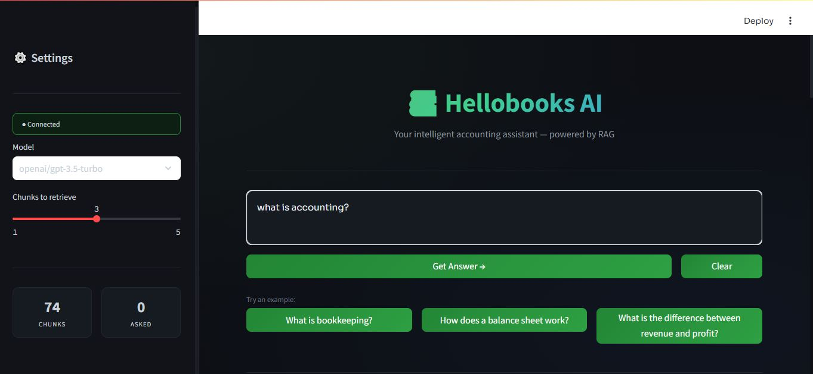
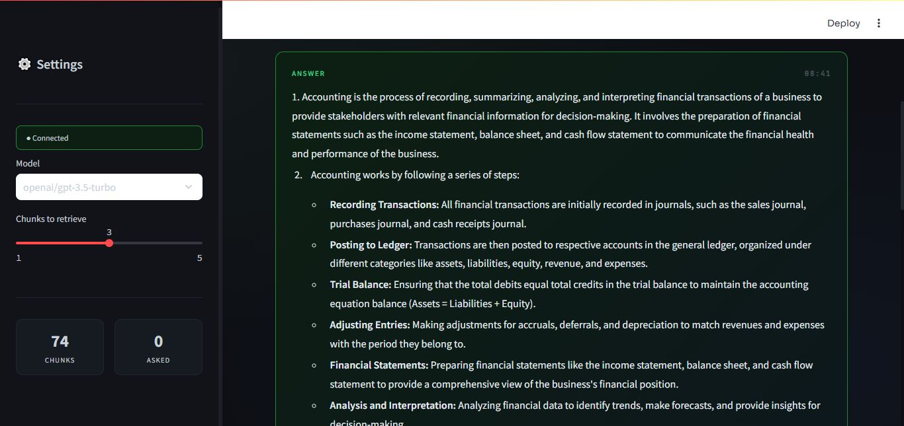
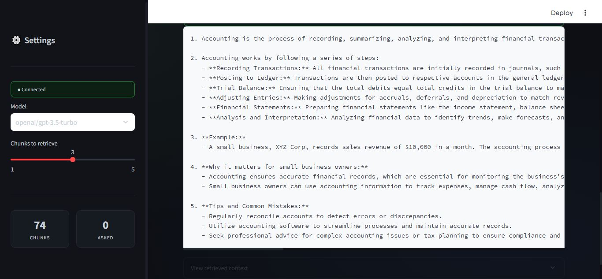

# 📚 Hellobooks AI Accounting Assistant

> A Retrieval-Augmented Generation (RAG) system that answers basic accounting questions using a curated knowledge base.


---





## 🧾 Project Overview

Hellobooks AI is a production-style RAG application that helps small business owners get clear, simple answers to common accounting questions. Instead of searching through documents manually, users ask natural language questions and receive AI-generated answers grounded in trusted accounting knowledge.

**Example:**

```
Q: "What is the difference between revenue and profit?"
A: "Revenue is the total income your business earns from sales before any
    costs are deducted. Profit is what remains after you subtract all your
    expenses from that revenue. For example, if you earn $10,000 in sales
    but spend $7,000 running your business, your profit is $3,000."
```

---

## 🏗️ Architecture

```
┌─────────────────────────────────────────────────────────┐
│                    Hellobooks AI System                  │
│                                                          │
│  ┌──────────┐    ┌──────────────────────────────────┐   │
│  │ Knowledge│    │         RAG Pipeline              │   │
│  │   Base   │───▶│                                   │   │
│  │ (8 .md   │    │  User Question                    │   │
│  │  files)  │    │       ↓                           │   │
│  └──────────┘    │  Embedding Model                  │   │
│                  │  (all-MiniLM-L6-v2)               │   │
│  ┌──────────┐    │       ↓                           │   │
│  │  FAISS   │◀───│  Vector Search (Top-3)            │   │
│  │  Index   │───▶│       ↓                           │   │
│  └──────────┘    │  Retrieved Context                │   │
│                  │       ↓                           │   │
│  ┌──────────┐    │  Prompt Builder                   │   │
│  │  OpenAI  │◀───│       ↓                           │   │
│  │   GPT    │───▶│  LLM Answer Generation            │   │
│  └──────────┘    │       ↓                           │   │
│                  │  Final Answer → API Response      │   │
│  ┌──────────┐    └──────────────────────────────────┘   │
│  │ FastAPI  │◀──────────────────────────────────────    │
│  │  Server  │                                            │
│  └──────────┘                                            │
└─────────────────────────────────────────────────────────┘
```

---

## 📁 Project Structure

```
hellobooks-ai-assistant/
│
├── data/                          # Knowledge base documents
│   ├── bookkeeping.md
│   ├── invoices.md
│   ├── profit_and_loss.md
│   ├── balance_sheet.md
│   ├── cash_flow.md
│   ├── expenses.md
│   ├── revenue.md
│   └── assets_vs_liabilities.md
│
├── src/                           # Application source code
│   ├── __init__.py
│   ├── loader.py                  # Document loading & chunking
│   ├── embeddings.py              # Sentence-transformer embeddings
│   ├── vector_store.py            # FAISS vector index management
│   ├── rag_pipeline.py            # Core RAG pipeline logic
│   └── api.py                     # FastAPI REST API
│
├── tests/
│   └── test_pipeline.py           # Unit & integration tests
│
├── vector_store/                  # Auto-generated after running main.py
│   ├── faiss.index
│   └── documents.pkl
│
├── main.py                        # Index builder (run once)
├── requirements.txt
├── Dockerfile
├── .env.example
├── .gitignore
└── README.md
```

---

## ⚙️ RAG Pipeline — Step by Step

| Step | Component         | Description                                                                     |
| ---- | ----------------- | ------------------------------------------------------------------------------- |
| 1    | `loader.py`       | Load `.md` files from `/data`, split into 500-char chunks with 100-char overlap |
| 2    | `embeddings.py`   | Convert each chunk to a 384-dim vector using `all-MiniLM-L6-v2`                 |
| 3    | `vector_store.py` | Store vectors in a FAISS `IndexFlatIP` index (cosine similarity)                |
| 4    | `rag_pipeline.py` | Embed incoming query → search FAISS → retrieve top-3 chunks                     |
| 5    | `rag_pipeline.py` | Build a context-rich prompt → send to OpenAI GPT                                |
| 6    | `api.py`          | Return JSON response with answer, sources, and similarity scores                |

---

## 🚀 Setup & Installation

### Prerequisites

- Python 3.10+
- An [OpenAI API key](https://platform.openai.com/api-keys)

### 1. Clone the Repository

```bash
git clone https://github.com/your-username/hellobooks-ai-assistant.git
cd hellobooks-ai-assistant
```

### 2. Create a Virtual Environment

```bash
python -m venv venv
source venv/bin/activate        # macOS/Linux
# or
venv\Scripts\activate           # Windows
```

### 3. Install Dependencies

```bash
pip install -r requirements.txt
```

### 4. Configure Environment Variables

```bash
cp .env.example .env
```

Edit `.env` and add your OpenAI key:

```env
OPENAI_API_KEY=sk-your-key-here
```

---

## 🏃 Running Locally

### Step 1 — Build the Knowledge Base Index

This loads all documents, generates embeddings, and saves the FAISS index:

```bash
python main.py
```

### Step 2 — Start the API Server

```bash
uvicorn src.api:app --reload --port 8000
```

The API is now live at: **http://localhost:8000**

Interactive docs: **http://localhost:8000/docs**

---

## 🐳 Running with Docker

### Build the Image

```bash
docker build -t hellobooks-ai .
```

### Run the Container

```bash
docker run -p 8000:8000 -e OPENAI_API_KEY=sk-your-key-here hellobooks-ai
```

Or with a `.env` file:

```bash
docker run -p 8000:8000 --env-file .env hellobooks-ai
```

---

##  API Reference

### `GET /`

Returns basic API information.

```json
{
  "name": "Hellobooks AI Accounting Assistant",
  "version": "1.0.0",
  "ask_endpoint": "POST /ask"
}
```

---

### `GET /health`

Health check — confirms the model and index are loaded.

```json
{
  "status": "healthy",
  "model": "all-MiniLM-L6-v2",
  "index_size": 87
}
```

---

### `POST /ask`

Ask an accounting question.

**Request:**

```json
{
  "question": "What is a balance sheet?"
}
```

**Response:**

```json
{
  "answer": "A balance sheet is a financial statement that shows what your business owns (assets), what it owes (liabilities), and what's left for the owners (equity) at a specific point in time. Think of it as a financial snapshot of your business on a particular date.",
  "sources": ["balance_sheet.md", "assets_vs_liabilities.md", "bookkeeping.md"],
  "scores": [0.8921, 0.7634, 0.7102]
}
```

---

